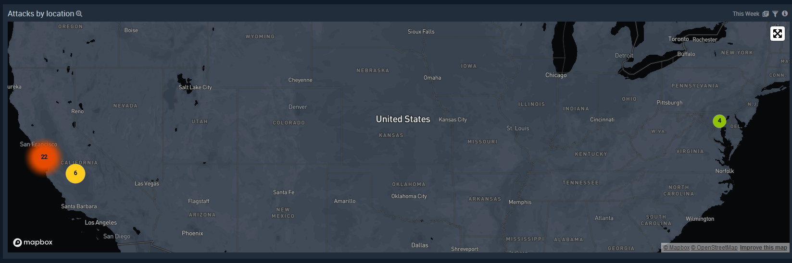
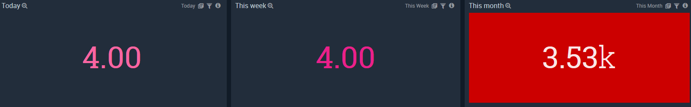
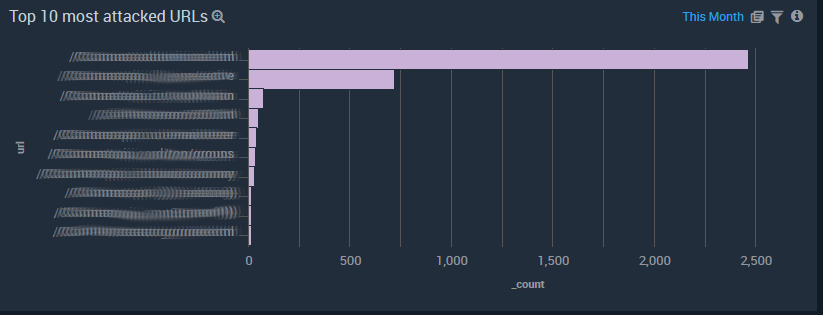
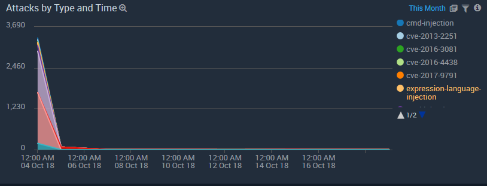
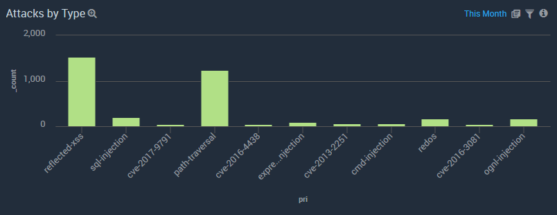
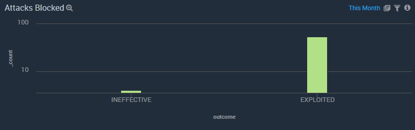
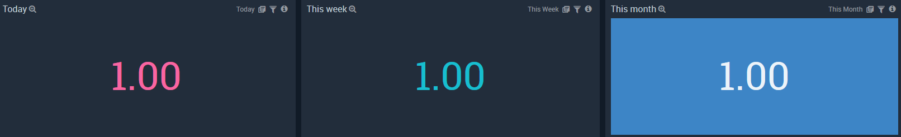
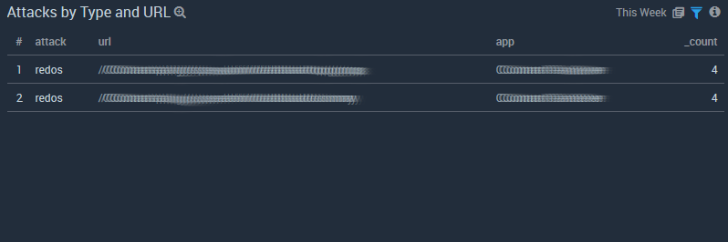
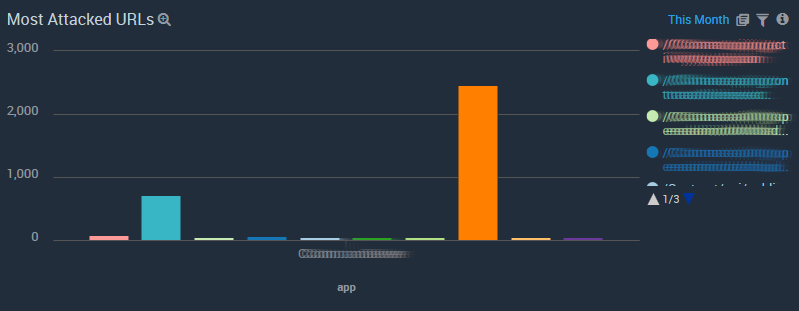
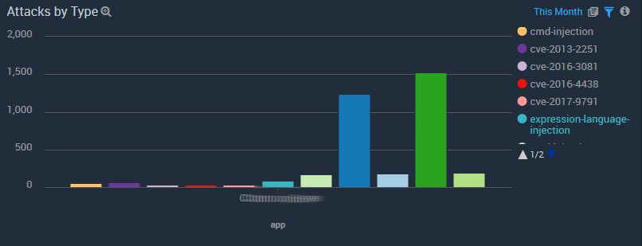

# Contrast SumoLogic Dashboard

These are starter dashboards to easily measure the amount of attacks that affect applications 

For instructions on how to import content to your library please refer to the official [Sumo Logic 
docs](https://help.sumologic.com/05Search/Library/Export-and-Import-Content-in-the-Library)

## Attacks Summary

### Attacks by location

### Attacks found counters

### Top 10 most attacked URLs

### Attacks by Type and Time

### Attacks by Type

### Attacks Blocked

## Attacks by applications dashboards

### Applications attacked counters

### Attacks by Type and URL

### Most attacked URLs

### Attacks by type

